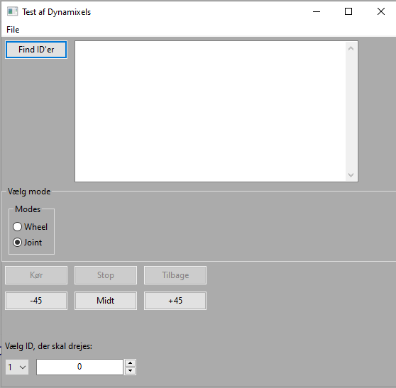

# DynamixelWxPython
## Basic Dynamixel Control with a wxPython GUI

Use wxFormbuilder to edit gui.fbp and generate a new gui.py file.




Kode, der giver fejl i wx:

```python
def turn( self, event ):
   # Dette giver problemer i wxPython GUI'en, men ikke som rent kommendoprompt
   vpos = self.spinPos.GetValue()
   Emu.moveJoint(self, self.valgtId, vpos)
   pos = Emu.getPos(self, self.valgtId)
   self.txtTest.AppendText(str(self.valgtId) + ': ' + str(pos) + '\r')
```


Se [dokumentation](html/EmuControl.html) lavet med pdoc3.